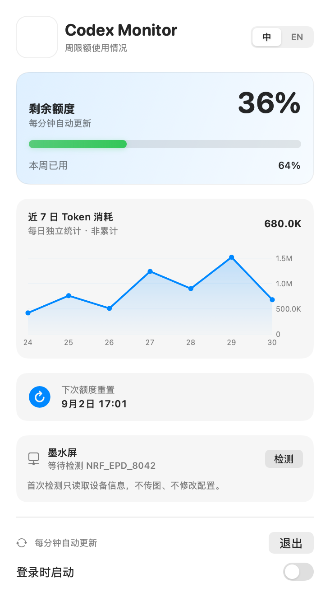
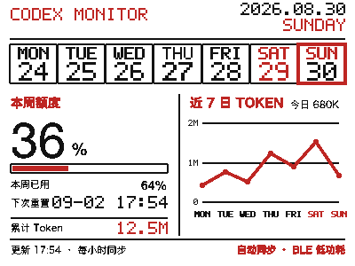

# Codex Monitor

[English](README.md)

Codex Monitor 是一个非官方、本地优先的 Codex 用量看板。同一仓库包含三套
可以独立使用的界面：

- 原生 macOS 菜单栏应用，以及中型/大型 WidgetKit 小组件；
- iPhone App，以及带手动刷新按钮的小型 WidgetKit 小组件；
- 面向 `NRF_EPD_8042` 的 400 × 300 黑白红三色蓝牙墨水屏看板。





## 包含内容

| 组件 | 数据来源 | 默认刷新策略 |
|---|---|---|
| macOS 菜单 | 本机启动的 `codex app-server` | 每分钟 |
| macOS 小组件 | App Group 内的脱敏快照；临时签名构建可回退到本机回环 | WidgetKit 时间线 |
| iPhone 小组件 | 独立的 OpenAI 设备授权与账户用量请求 | 每 15 分钟 + 手动按钮 |
| 蓝牙墨水屏 | macOS 应用生成的黑/红位图 | 每小时检查，跨日立即检查 |

墨水屏采用短连接：先比较稳定的画面哈希，内容没有变化时完全不启动蓝牙；
需要更新时执行“连接 → 发送 → 断开”。连接或写入失败会自动重试一次。

## 快速开始

### macOS 应用

1. 从 [Releases](https://github.com/Mintzz666/codex-monitor/releases) 下载 DMG。
2. 将 **Codex Monitor** 拖入 `/Applications`。
3. 确认官方 Codex CLI/App 已安装并登录。
4. 启动 Codex Monitor；应用会读取本机数据并默认注册登录时启动。

社区构建默认使用临时签名。若 Gatekeeper 阻止首次启动，可以右键应用选择
**打开**，或按文档自行从源码构建。

### iPhone App 与小组件

iPhone 目标需要使用你自己的 Apple Development Team 构建。先将示例 Bundle
ID、App Group 和 Keychain Group 改成你自己的唯一标识，再打开
`Mobile/CodexMonitorMobile.xcodeproj`，安装到真机、完成设备授权，最后添加
**Codex Monitor** 小型组件。

详见：[iPhone 复现指南](docs/setup-ios.md)。

### 蓝牙墨水屏

给 `NRF_EPD_8042` 4.2 英寸 400 × 300 黑白红墨水屏供电，并放在 Mac
蓝牙范围内。允许 Codex Monitor 使用蓝牙后，程序可以自动发现设备；
“检测”只读取硬件信息，“立即同步”可手动触发一次数据检查。

详见：[墨水屏硬件与协议指南](docs/setup-epd.md)。

## 从源码构建

需要：

- macOS 13 或更高版本；
- 完整 Xcode，以及支持 Swift 6.3 的工具链；
- 运行真实 macOS 数据测试时，需要官方 Codex CLI/App；
- 只有重新生成已检入的 Xcode 工程时才需要 XcodeGen。

```sh
git clone https://github.com/Mintzz666/codex-monitor.git
cd codex-monitor

make test
make package
make dmg
```

使用 Apple Development Team 签名前，请把
`com.example.codexmonitor` 和 `group.com.example.codexmonitor`
全部替换成属于你团队的唯一标识，然后重新生成工程：

```sh
brew install xcodegen
make xcode-project
(cd Mobile && xcodegen generate --spec project.yml)
```

完整步骤：[macOS 构建指南](docs/setup-macos.md)。

## 数据与隐私

macOS 端只启动本机已经安装的 `codex app-server`，调用 `account/read`、
`account/rateLimits/read` 和 `account/usage/read`。登录与令牌刷新仍由 Codex
负责；本应用不读取浏览器 Cookie，也不复制 Codex 凭据。

iPhone 端独立登录。OAuth 凭据只保存在 App 与小组件共享的 iOS Keychain
Group；App Group 只保存不敏感的额度快照。手机端接口跟随官方开源 Codex
实现，但它不是单独面向第三方发布的稳定 API，未来可能需要跟随上游调整。

项目不包含统计分析、广告 SDK、云数据库或开发者运营的后端服务。
详见：[架构、数据流与隐私](docs/architecture-and-privacy.md)。

## 复现文档

- [macOS 应用和小组件](docs/setup-macos.md)
- [iPhone App 和小组件](docs/setup-ios.md)
- [蓝牙墨水屏看板](docs/setup-epd.md)
- [架构、数据流与隐私](docs/architecture-and-privacy.md)
- [发布流程](docs/releasing.md)
- [参与贡献](CONTRIBUTING.md)
- [安全策略](SECURITY.md)

## 许可与归属

项目使用 MIT 协议，基于
[`CMMUU/codex-usage-bar`](https://github.com/CMMUU/codex-usage-bar) 改造。
原项目版权和 MIT 条款保留在 [LICENSE](LICENSE)，其他说明见
[NOTICE.md](NOTICE.md)。

Codex、ChatGPT、OpenAI、Apple、iPhone 及相关硬件名称归各自权利人所有。
本项目是社区项目，与 OpenAI、Apple 或硬件厂商不存在隶属或背书关系。
